# Terminology

- Source: The source language (the language you already know).
- Target: The target language (the language you are learning).

# Memrise

To begin with, Memrise simply shows you the source and target word to begin with.

Some courses will also display extra information in a toggleable section below such as gender, plurality, case and so on.

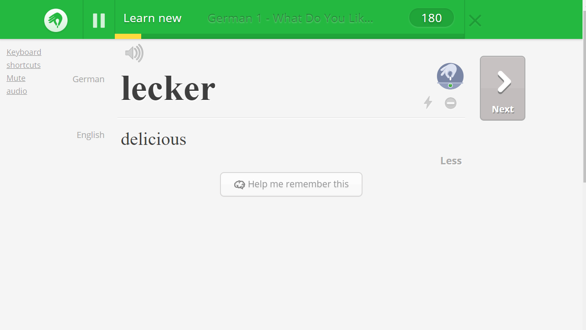

After that, you'll be given a list of target words and you'll have to pick which of them matches the displayed source word.

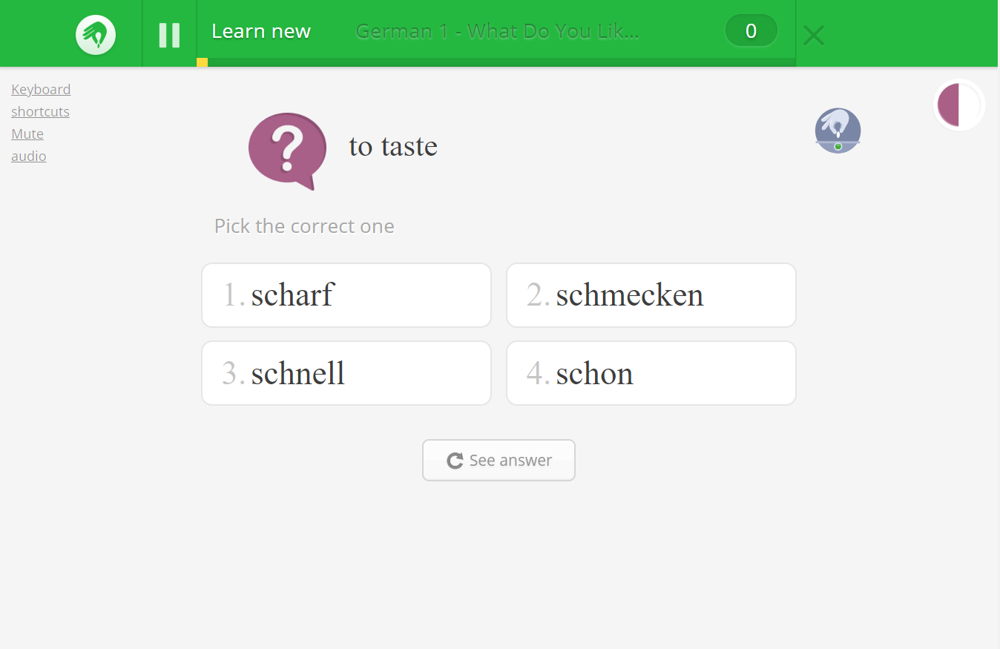

There are also variations of the above for both audio:

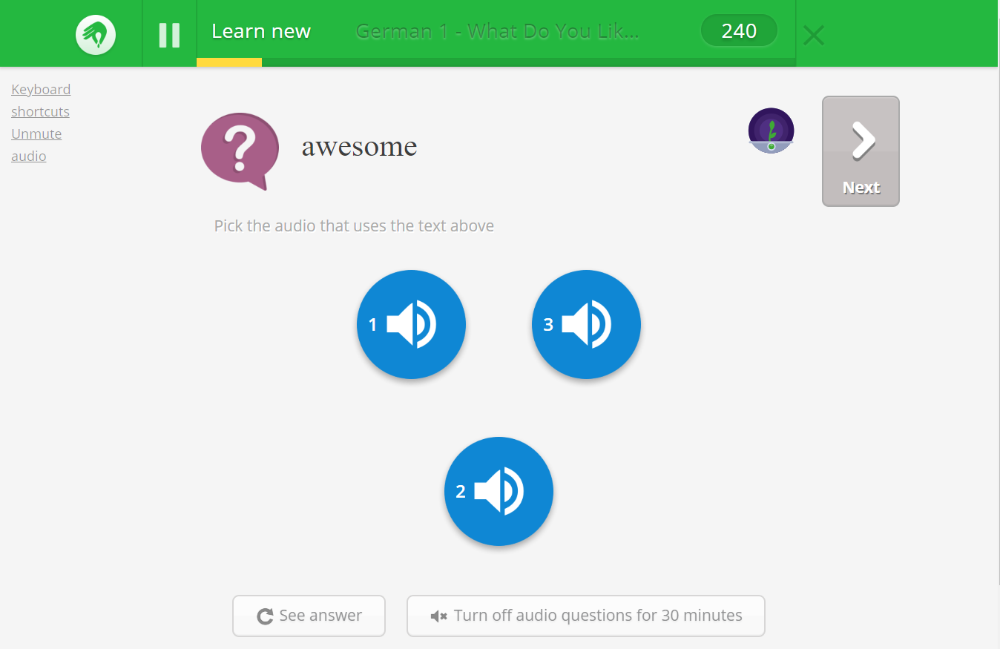

And video:

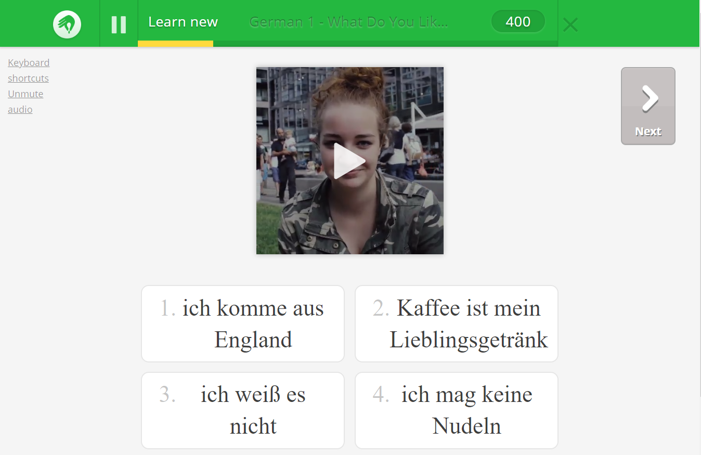

After that, Memrise will start asking you to type the target word:

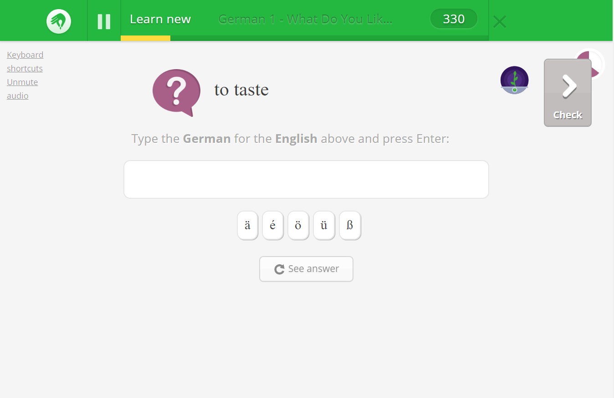

Another exercise involves choosing the correct words in order:

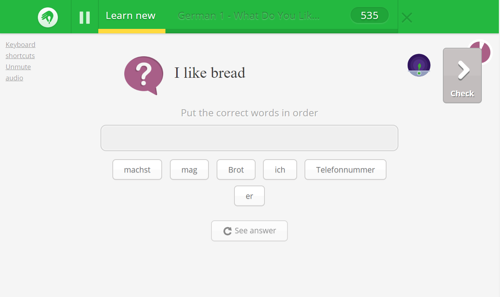

# Duolingo

At the very beginning Duolingo uses a visual method.

You'll be displayed several images each alongside the target translation and you have to choose which of those matches the source word.

This method is used mostly at the bottom (beginning) of the tree and/or on low level skills (1-2~/5).

After a very short while it will switch to (by default) having you select the correct source word for the displayed target word out of a pool of words.

However the user can optionally switch to keyboard input should they desire, unlike with Memrise.

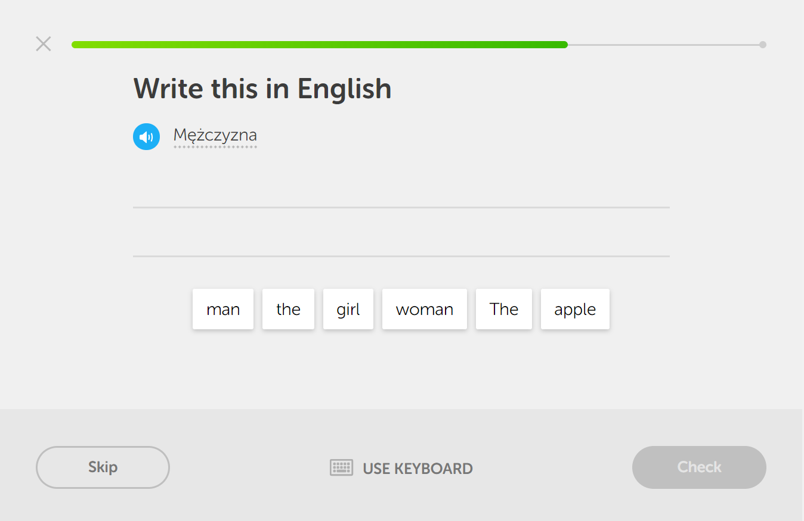

Shortly thereafter it will start introducing new words in a similar fashion as above and have you translate the entire sentence:

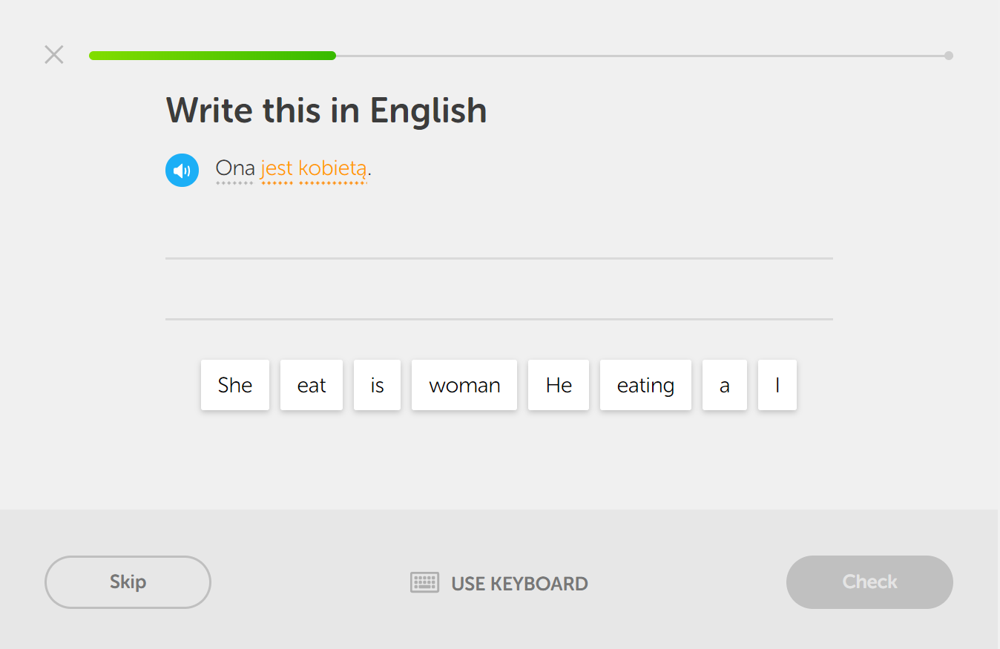

You are of course able to hover over the new words to see their definitions.

One possible exercise is that you'll be given a list of words in the target language and a single word in the source language.

You need to select the correct meaning/translation.

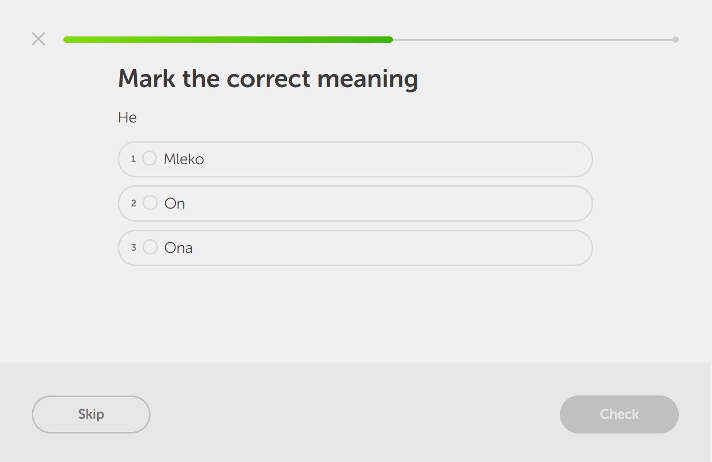

Another similar option has you selecting the missing word instead.

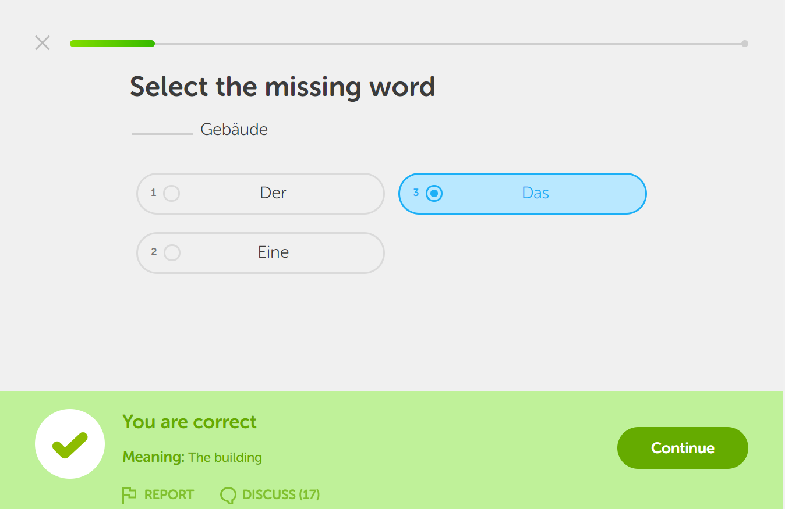

There's also a variant of "write this word" that includes a visual prompt:

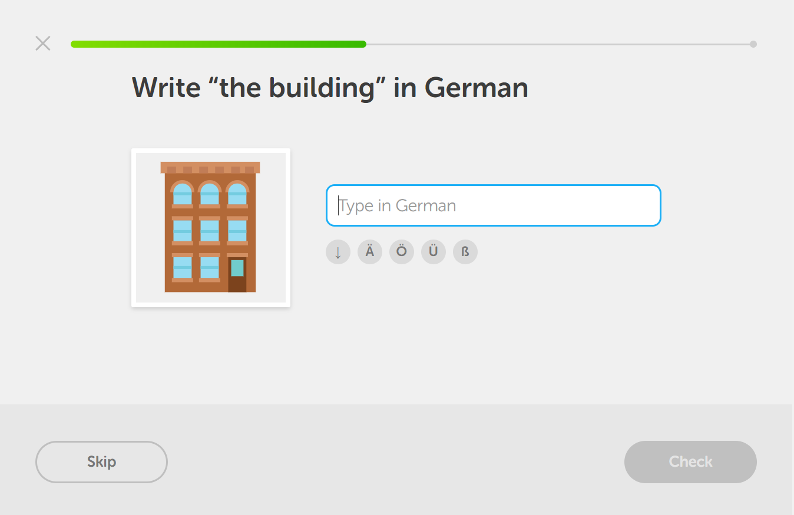

--------

# Miscellaneous notes

## Multiple choice shortcuts

Memrise lets you do the "put the words in the correct order" exercises entirely via the keyboard which is great. Duolingo doesn't support this.

But if you make a mistake you can't press the number key to remove the word, which would be a nice improvement.

## Auto-detection of correct answers

Memrise will basically automatically proceed to the next vocabulary item if it detects that you've written or selected the correct answer but this doesn't always work (case sensitivity is a problem, alternate answers don't trigger the behaviour etc.). Those would be nice improvements.

## Long lines for multiple choice questions

Memrise ends up looking really bad if any of the choices have long lines. This could easily be fixed.

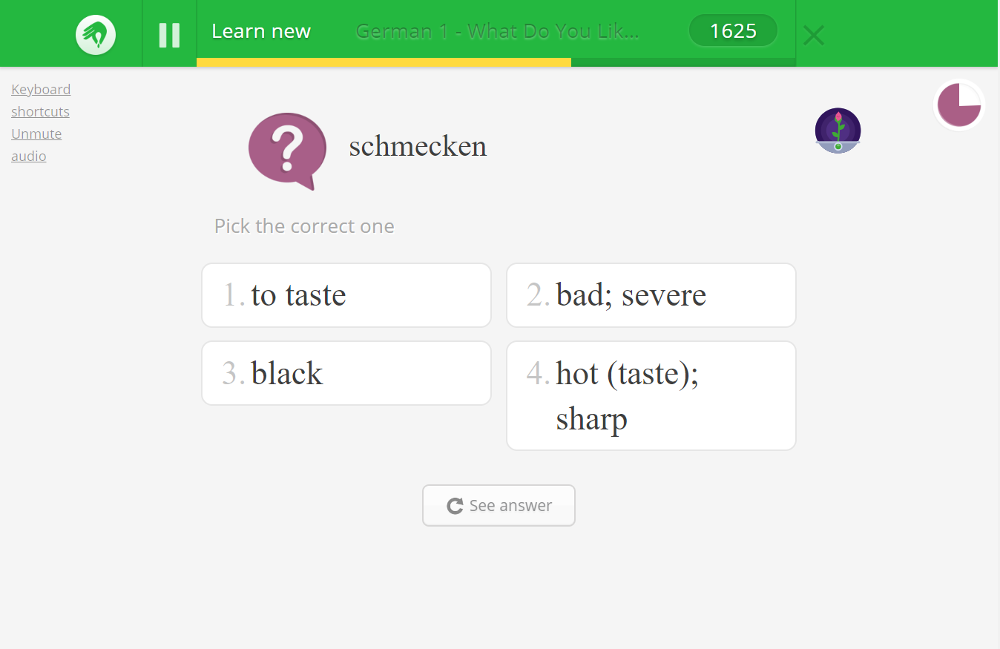

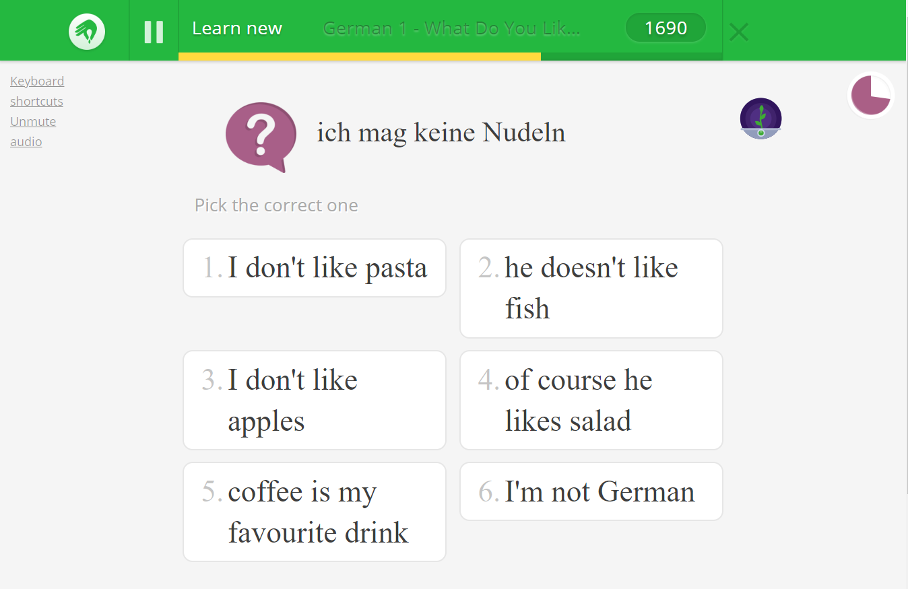

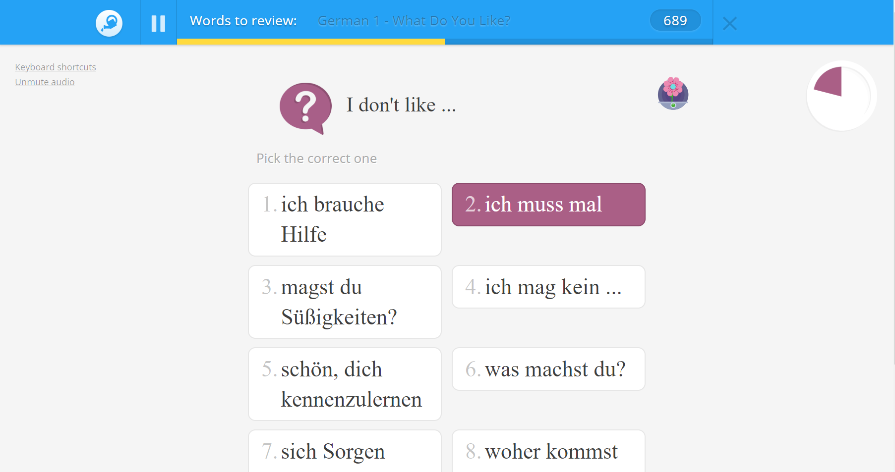