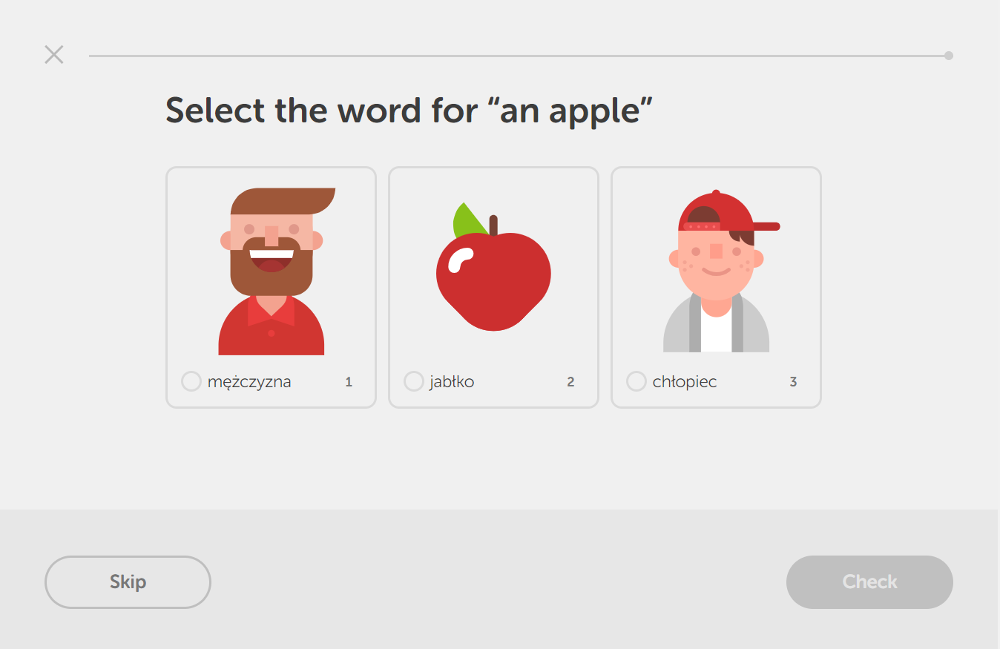

# Lessons

## Word Definition

First of all, we need a way to display new words that the user hasn't yet learned.

### Memrise's Method

TODO: Finish this when Memrise's CDN comes back up again. xD

### Duolingo's Method

At the very beginning, Duolingo uses a visual method where you basically need to choose the right image for the word in the source language.

Then, after a little while, it will switch to having you write the word in the source language:

After that it will start introducing new words in a similar fashion and have you translate the sentence:

You are of course able to hover over the new words to see their definitions.

Shortly thereafter it will start giving you selection exercises:

--------